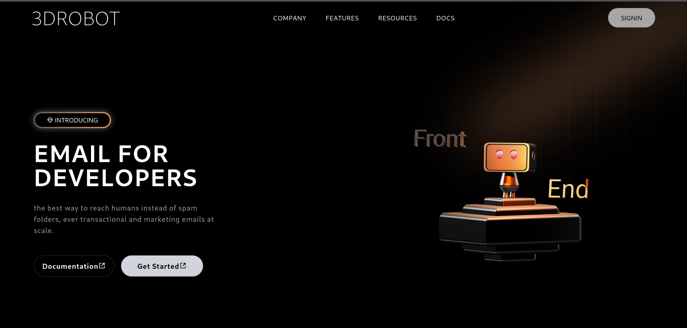

# 🤖 3Drobot

**3Drobot** is a simple front-end project that demonstrates how to integrate interactive 3D objects into a React application using [Spline](https://spline.design/).  
The project also makes use of **TailwindCSS** for styling, **AOS (Animate On Scroll)** for smooth animations, and **Vite** as the build tool and development server.

---

## 🚀 Technologies Used

- **React** – JavaScript framework for building the user interface.
- **Spline** – Tool to create and embed 3D objects/animations directly in the browser.
- **TailwindCSS** – Utility-first CSS framework for fast and responsive design.
- **AOS** – Library for scroll-triggered animations.
- **Vite** – Next-generation frontend tooling for fast builds and hot reload.

---

## 🎨 Features

- Integration of an **interactive 3D model** (via Spline).
- Responsive layout with **Tailwind**.
- **Smooth animations** on scroll with AOS.
- **Single Page Project** (front-end only).
- Fast dev server & optimized builds with **Vite**.

---

## ⚙️ Installation & Running

1. **Clone the repository**:
   ```bash
   git clone https://github.com/your-username/3Drobot.git
   cd 3Drobot
   ```

2. **Install dependencies**:
   ```bash
   npm install
   ```

3. **Start the development server** (Vite):
   ```bash
   npm run dev
   ```
   The project will be available at [http://localhost:5173](http://localhost:5173) (or the port shown in your terminal).

4. **Build for production**:
   ```bash
   npm run build
   ```

5. **Preview the production build**:
   ```bash
   npm run preview
   ```

---

## 📂 Project Structure

```bash
3Drobot/
 ├── src/
 │   ├── components/    # React components
 │   ├── App.jsx        # Main page
 │   └── index.css      # Global styles (including Tailwind)
 ├── public/            # Static files
 ├── package.json       # Dependencies & scripts
 ├── vite.config.js     # Vite configuration
 └── README.md          # Project documentation
```

---

## 📸 Preview


---

## 📝 License

This project was built for educational purposes. Feel free to modify and use it!
